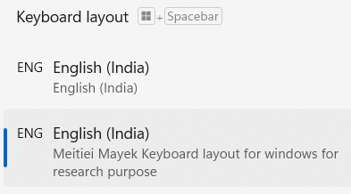
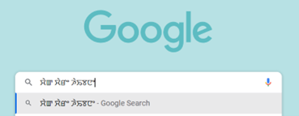
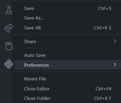
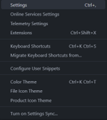
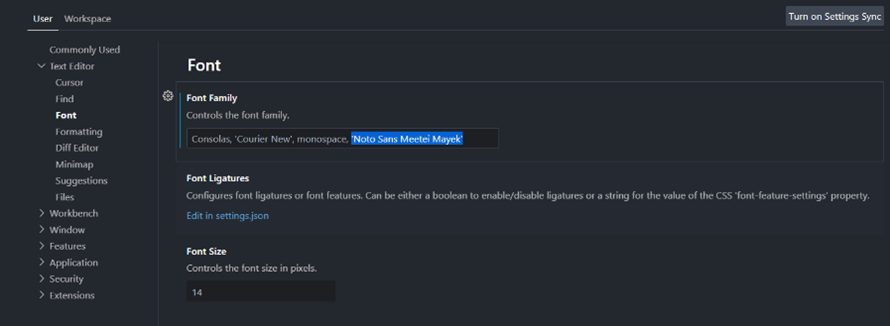

# kybd-mm

Meetei/Meitei Mayek Character Keyboard.

This repository contains khut_e.zip from which you can extract and install Meetei Mayek in Windows/Ubuntu.

- Download and install khut_e.zip for windows
- Download and install Eeyek-2.0.zip for ubuntu

## 1. Keyboard Layout

### 1.1. Normal Mode

### 1.2. Shift Mode

Hold `Shift` and Type.

### 1.3. Ctrl Mode

Hold `Ctrl` and Type. (Might not probably work if `Ctrl` is bound as part of shortcuts, eg., `Ctrl`+`Z` is undo so typing `Z` might not work.)

## 2. Instructions

1. Download and extract **khut_e.zip**
2. Run `setup.exe` and install the khut_e font.
3. Press `Windows` + `Space` to change Language
   
4. You can type in **MS Office** apps by default (MS Word, MS Powerpoint, MS Excel) but if the glyphs are not visible in **notepad** (if it shows boxes instead of the correct characters), you can fix it by typing using the font in any other app which can display Meitei Mayek by default. (Eg., MS Word)

## 3. Fonts

Nirmala UI supports Meetei/Meitei Mayek by default in windows. But it is preferred to download and install [Noto Sans Meetei Mayek](https://fonts.google.com/noto/specimen/Noto+Sans+Meetei+Mayek) from Google Fonts.

This repository also contain a copy of [Eeyek font](http://tabish.freeshell.org/eeyek/download.html) which can be used to type Meetei/Meitei Mayek in Ubuntu OS.

## 4. FAQs

### 4.1. Typing in Google Chrome

1. **Settings** > **Appearance** > **Customize fonts** or type **chrome://settings/fonts** in search bar and press `Enter`
2. **Customize fonts** > **Standard font** > pick **Noto Sans Meetei Mayek**

   

3. Screenshot of Typing

   

### 4.2. Typing in VS Code

1. Click on **File**

   

2. Go to **Preferences**

   

3. Go to **Settings**

   

4. Add **Noto Sans Meetei Mayek** in **Font** of **User** Settings

   

5. Screenshot of Typing

   

### 4.3. Typing in Google Collab/Jupyter Notebook

Similar to **Section 4.1.**

### 4.4 How do i go back to my usual keyboard?

Press `Windows` + `Space` again till you change it back.

## Warning

- The character in the keyboard is not in the default system code page (1252) of the English (India) language you specified. This may cause compatibility problems in non-Unicode applications.

## See also

- [Speech Dataset](https://github.com/hoomexsun/speech_dataset).
- [Meetei/Meitei Mayek Transliteration](https://github.com/hoomexsun/mm_transliteration).
- [Meetei/Meitei Mayek Keyboard for Windows](https://github.com/hoomexsun/mm_keyboard).
- [IPA Keyboard for Windows](https://github.com/hoomexsun/ipa_keyboard).
- [S-550 Glyph Correction](https://github.com/hoomexsun/s550_glyph_correction).
- [Epaomayek Glyph Correction](https://github.com/hoomexsun/epaomayek_glyph_correction).
- [Microsoft Keyboard Layout Creator](https://www.microsoft.com/en-us/download/details.aspx?id=102134)
